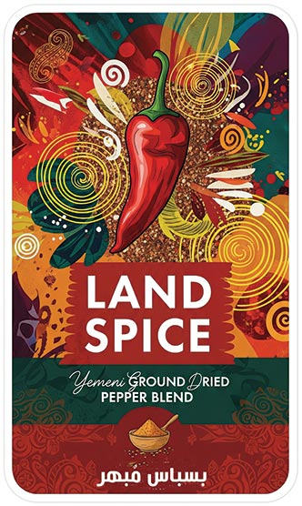
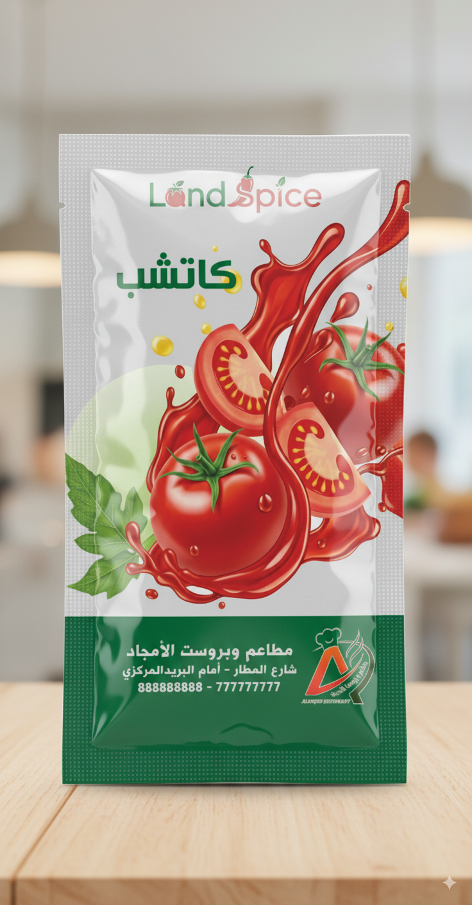

# Land Spice | لاند سبايس

## شبكات التواصل الإجتماعي
 روابط الشبكات الاجتماعية التالية:

Youtube: https://youtube.com/@LandSpice
TikTok: https://tiktok.com/@landSpice
Facebook: https://facebook.com/LandSpice25
X: https://x.com/landSpice25
WhatsApp Channel: https://whatsapp.com/channel/0029Vb62xmZC6ZvZa3u0Yn0C
Whatsapp No.: https://whatsapp.com/sender=967776209864

---

<p align="center">
  
</p>

# LandSpice | لاند سبايس

منصة واجهة أمامية لعرض منتجات لاند سبايس اليمنية بجودة عالية وتجربة استخدام مميزة، مع دعم كامل للغة العربية (RTL) والإنجليزية، ووضع النهار/الليل، وروابط تواصل اجتماعي غنية. مبنية باستخدام React + Vite + Tailwind CSS.

English: A modern, bilingual (AR/EN) marketing site for LandSpice products with smooth UX, social sidebar, and Firebase Analytics. Built with React + Vite + Tailwind CSS.

## محتويات الدليل | Table of Contents

- مقدمة | Overview
- المزايا | Features
- لقطات وصور | Screenshots
- هيكل المشروع | Project Structure
- التشغيل محليًا | Getting Started
- الترجمة والاتجاه | i18n & RTL
- السمات (داكن/فاتح) | Theming
- الإعدادات والخدمات | Configuration & Services
- البناء والنشر | Build & Deployment
- الروابط الاجتماعية | Social Links
- الترخيص والتواصل | License & Contact

## مقدمة | Overview

هذا التطبيق يعرض:

- قائمة علوية ثابتة مع أقسام الصفحة.
- شريط جانبي للشبكات الاجتماعية قابل للتثبيت (Pin) ويعمل على الجوال وسطح المكتب.
- أقسام منظمة: البطل (Hero)، المنتجات، المعرض، الجودة، الشركاء، الأسئلة الشائعة، التواصل.
- تتبع زيارات الصفحة عبر Firebase Analytics.

## المزايا | Features

- دعم كامل للغة العربية والإنجليزية (RTL/LTR).
- وضع داكن/فاتح محفوظ في المتصفح.
- تمرير سلس للأقسام وروابط مرساة محسّنة مع `scroll-margin-top`.
- تصميم متجاوب وعصري باستخدام Tailwind CSS.
- أداء عالٍ بفضل Vite وReact 18.

## لقطات وصور | Screenshots

> الصور موجودة داخل `public/` وتُستخدم كذلك داخل التطبيق.

<p>
  
  
</p>

<p>
  
  
  
  
</p>

## هيكل المشروع | Project Structure

```
LandSpice/
├─ public/
│  ├─ favicon.png
│  ├─ logo.png, logoB.png, landSpiceLogo.png, landSpiceLogo-B.png
│  └─ img/
│     └─ Product/ (صور المنتجات)
├─ src/
│  ├─ components/
│  │  ├─ Header.jsx (القائمة + الشريط الاجتماعي)
│  │  ├─ Hero.jsx, Products.jsx, GallerySlider.jsx, Quality.jsx,
│  │  │  Partners.jsx, FAQ.jsx, Contact.jsx, Footer.jsx ...
│  │  └─ ThemeToggle.jsx, ImageModal.jsx, ScrollToTop.jsx
│  ├─ pages/
│  │  └─ Home.jsx, About.jsx
│  ├─ styles/
│  │  └─ index.css (متغيرات الألوان + Tailwind)
│  ├─ firebase/
│  │  └─ config.js (Firebase Analytics)
│  ├─ i18n.js (تهيئة الترجمة)
│  ├─ App.jsx, main.jsx
│  └─ vite.config.js, tailwind.config.js, postcss.config.js
├─ index.html
├─ package.json
└─ firebase.json, .github/workflows/* (إن وُجدت CI للنشر)
```

## التشغيل محليًا | Getting Started

1) المتطلبات | Prerequisites

- Node.js 18+ وnpm.

2) التثبيت | Install

```bash
npm install
```

3) التشغيل | Run dev

```bash
npm run dev
```

سيفتح Vite خادم تطوير على منفذ افتراضي (عادة 5173). ادخل إلى `http://localhost:5173`.

4) البناء | Build

```bash
npm run build
```

5) المعاينة | Preview

```bash
npm run preview
```

## الترجمة والاتجاه | i18n & RTL

- ملف الترجمة: `src/i18n.js` مع موارد `ar` و`en`.
- اللغة المحفوظة في `localStorage` تحت المفتاح `lang`.
- يتم ضبط `dir` و`lang` لعناصر `<html>` تلقائياً عند تغيير اللغة.

## السمات (داكن/فاتح) | Theming

- يتم تحديد الوضع من `localStorage.theme` أو تفضيل النظام.
- تُطبق فئة `dark` على العنصر الجذري لتفعيل الألوان الداكنة.

## الإعدادات والخدمات | Configuration & Services

- Firebase Analytics مُفعّل عبر `src/firebase/config.js`.
- المفاتيح علنية في تطبيقات الويب، لكنها مقيّدة إعدادياً من خلال كونسول Firebase.
- إن رغبت بإدارة المفاتيح عبر `.env` يمكن تكييف Vite مع `import.meta.env` (اختياري مستقبلاً).

## البناء والنشر | Build & Deployment

- الأداة: Vite.
- الإطارات: React 18، Tailwind CSS 3، React Router 6.
- النشر المقترح: Firebase Hosting.

خطوات عامة للنشر على Firebase Hosting:

```bash
npx firebase-tools login
npx firebase-tools init hosting  # اختر المجلد الجذر (.) أو إعداداتك الحالية
npm run build
npx firebase-tools deploy
```

كما يمكن إعداد CI عبر GitHub Actions إن توفرت ملفات مثل:

- `.github/workflows/firebase-hosting-merge.yml`
- `.github/workflows/firebase-hosting-pull-request.yml`

## الروابط الاجتماعية | Social Links

- YouTube: https://youtube.com/@LandSpice
- TikTok: https://tiktok.com/@landSpice
- Facebook: https://facebook.com/LandSpice25
- X: https://x.com/landSpice25
- WhatsApp Channel: https://whatsapp.com/channel/0029Vb62xmZC6ZvZa3u0Yn0C

## الترخيص والتواصل | License & Contact

- 2025 LandSpice. جميع الحقوق محفوظة | All rights reserved.
- البريد: landspices2025@gmail.com
- واتساب المبيعات: +967 776 209 864